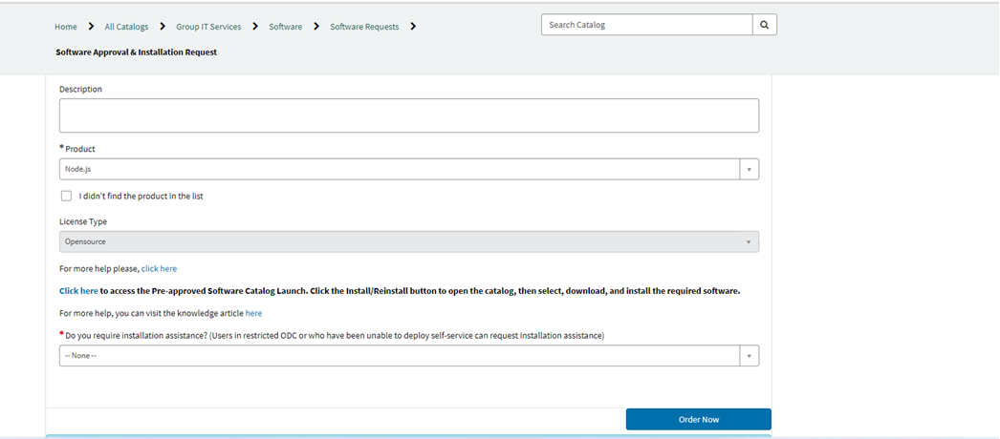
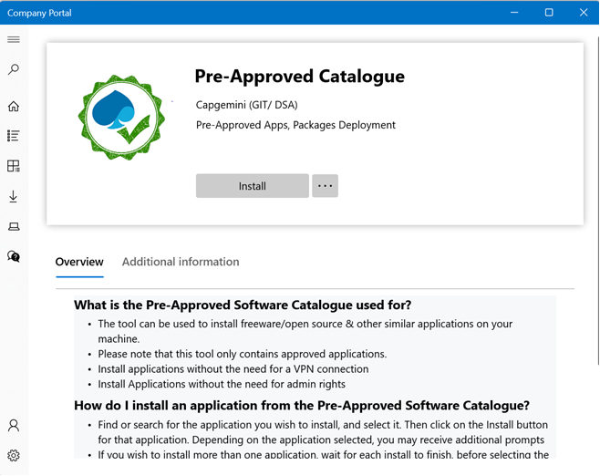
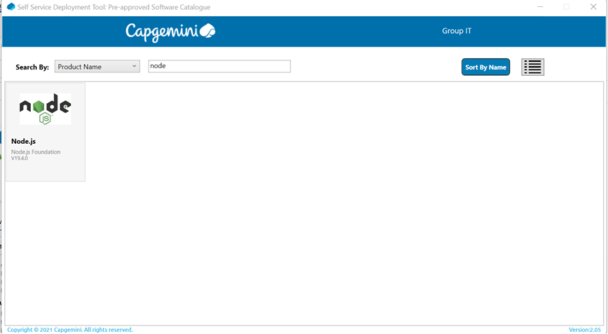

# Playwright installation

## Prerequires
* You will need an IDE to run your code. I suggest installing Visual Studio Code as it's more lightweight and contains good extensions for Playwright --- https://code.visualstudio.com/

* You will need to have NodeJs and basics of npm 
On Windows, in order to install NodeJS you need to go to https://nodejs.org/download/ and download the latest version
Once you have the .msi file you can click on it and install it
Installation requires admin rights, so if you are on a Capgemini laptop, you can install NodeJs via the Service Central.
* Go to Service Central > Software request -- https://servicecentral.capgemini.com/sc?id=sc_cat_item&sys_id=2706c85a1b338110a77f33799b4bcbf4

* Click on the Click here to access the Pre-approved catalog Launch
* Install the Pre-approved Catalogue

* Once installed, you should have access to search for different tools that need admin rights to be installed (e.g. node)

 
* In order to check if NodeJs was successfully installed, you can open a cmd terminal and type:
```
node -v
```

And a version number should pop up

## Installation
Once NodeJs is installed, you can install Playwright as a npm package.

Go to a directory where you want to start a new project (in my case in the C driver in the folder "Automation" I have created another folder "Playwright" which will serve as my Demo project in these lessons)

```
C:\Automation\Playwright>npm init playwright@latest

```

By default Chromium will be installed, if you want to run on proprietary browsers like chrome or edge you will need to install them separately.

```
npx playwright install msedge
```

## Next lesson 
[How to run Playwright](https://github.com/cristinavelican/PlaywrightIntroduction/blob/main/Lessons/Lesson2-Running.md)
